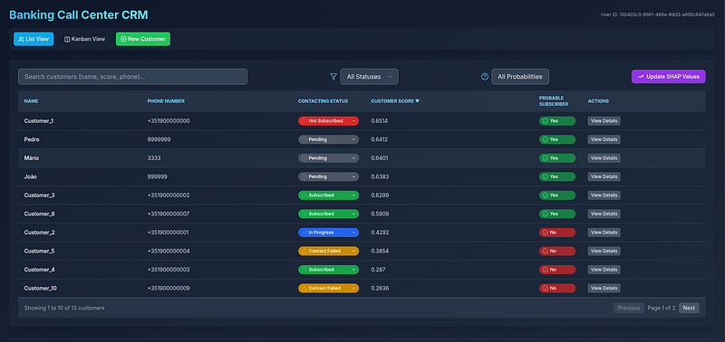

# **Como o *Machine Learning* poderia Aumentar em 4x a Eficiência de Vendas Bancárias**

## Modelo de machine learning

**1. O Cenário e o Gargalo Operacional**

 Imagine uma operação de telemarketing bancário enfrentando uma lista de 12.357 clientes. Na abordagem tradicional, a equipe realiza chamadas para toda a base, sem qualquer tipo de priorização. O resultado dessa abordagem "às cegas" é um desgaste operacional e uma taxa de sucesso de apenas **11,3%** (1.392 conversões em mais de 12 mil tentativas). Assim, o problema da operação é a alocação ineficiente de tempo e recursos.

**2. A Descoberta nos Dados e o Desenho da IA**

Para encontrar o padrão oculto por trás do perfil dos compradores, analisei uma base histórica com aproximadamente 41 mil registros e 20 variáveis de campanhas de investimento de uma instituição bancária (fonte: [https://archive.ics.uci.edu/dataset/222/bank+marketing](https://archive.ics.uci.edu/dataset/222/bank+marketing)).

- **A Estratégia do Algoritmo:** Treinei um modelo de *Random Forest*  com 19 variáveis preditoras (*features*), ajustando os hiperparâmetros (a combinação ótima foi `mtry = 1` e `minimum trees = 14`).
- **Generalização e Estabilidade:** O modelo alcançou uma **AUC de 0,788** no treinamento e **0,790** no conjunto de teste (composto por mais de 12 mil exemplos (nunca antes utilizados para o treinamento deste modelo). Essa convergência de métricas sugere a capacidade de generalização do algoritmo, confirmando que não houve *overfitting* (em outras palavras, o modelo conseguiu encontrar um padrão que explica os dados e não "decorou" esses nem ficou ajustado ao ruído).
- **O Ponto Forte do Modelo (Especificidade de 89%):** demonstrou boa capacidade em filtrar os *verdadeiros negativos*; aprendeu a descartar quem **não** iria comprar.
- **Sensibilidade e Erro Preditivo:** A sensibilidade ficou em **60%** (capacidade de identificar os potenciais compradores), apresentando uma taxa de falsos negativos de **4,5%** (558 clientes que contratariam o investimento, mas foram classificados como não propensos).
- **Fatores Decisivos:** A variável de maior relevância preditiva foi o histórico de contatos prévios com o cliente, seguida por indicadores macroeconômicos (como a taxa de ocupação no mercado de trabalho).

**3. Da Previsão para Ação**

Uma métrica isolada não gera valor se o usuário final não souber como utilizá-la. Para conectar a inteligência estatística à rotina diária dos atendentes, desenvolvi um protótipo de sistema focado em usabilidade e explicabilidade (*XAI - Explainable AI*):

- **Fila de Priorização Automática:** A aplicação ordena os clientes pelo *score* predito de aceitação da campanha.
- **Explicabilidade Individual (XAI):** O sistema detalha os fatores marginais que formaram aquele *score*. O operador consegue ver exatamente se a faixa etária do cliente reduziu a probabilidade ou se o estado civil aumentou a propensão de aceite.
- **Tecnologias utilizadas:** O modelo foi treinado em **R**, exposto via API REST com **Python (FastAPI)**, conteinerizado com **Docker** e hospedado em nuvem (**GCP** para a API/banco e **Railway** para o front-end). Além disso, o Cursor para geração de código.

Veja mais detalhes sobre as funcionalidades do protótipo no fim deste documento.

[Acesse a aplicação em produção aqui](https://bankcalls-production.up.railway.app/)

**4. O possível impacto**

Ao aplicar o modelo preditivo para filtrar a fila de chamadas no conjunto de teste, o resultado prático da operação muda drasticamente:

| Métrica de Negócio          | Abordagem Tradicional (Sem ML)      | Abordagem Preditiva (Com ML)              |
| --------------------------- | ----------------------------------- | ----------------------------------------- |
| **Volume de Ligações**      | 12.357 chamadas (conjunto de teste) | ~2.000 chamadas (**83% de redução**)      |
| **Taxa de Conversão**       | 11,3% de sucesso                    | **41,3% de sucesso (quase 4x maior)**     |
| **Produtividade da Equipe** | Alta rejeição e desperdício         | Foco exclusivo nos perfis de alto retorno |

A equipe deixa de realizar 10 mil ligações improdutivas, enquanto a taxa de conversão sobre para 41,3%, otimizando o custo por aquisição e acelerando o tempo de geração de valor para o banco.

Sem o modelo de *machine learning*,  a equipe liga para todos os 12.357 clientes e fecha negócio com apenas 11,3% deles — o que significa cerca de 11 vendas a cada 100 ligações. Com o modelo, o time foca apenas nas 2.021 pessoas recomendadas e a taxa de acerto salta para 41,3% (41 vendas a cada 100 tentativas). Na prática, a ferramenta multiplica a eficiência das vendas por quase quatro vezes e evita mais de 10 mil ligações desnecessárias.

**5. Considerações e Próximos Passos**

A utilização de um modelo preditivo — mesmo com desempenho moderado — sugere que a priorização guiada por dados reorganiza a dinâmica operacional de equipes de vendas. 

## Detalhes das Funcionalidades do Protótipo de Sistema

